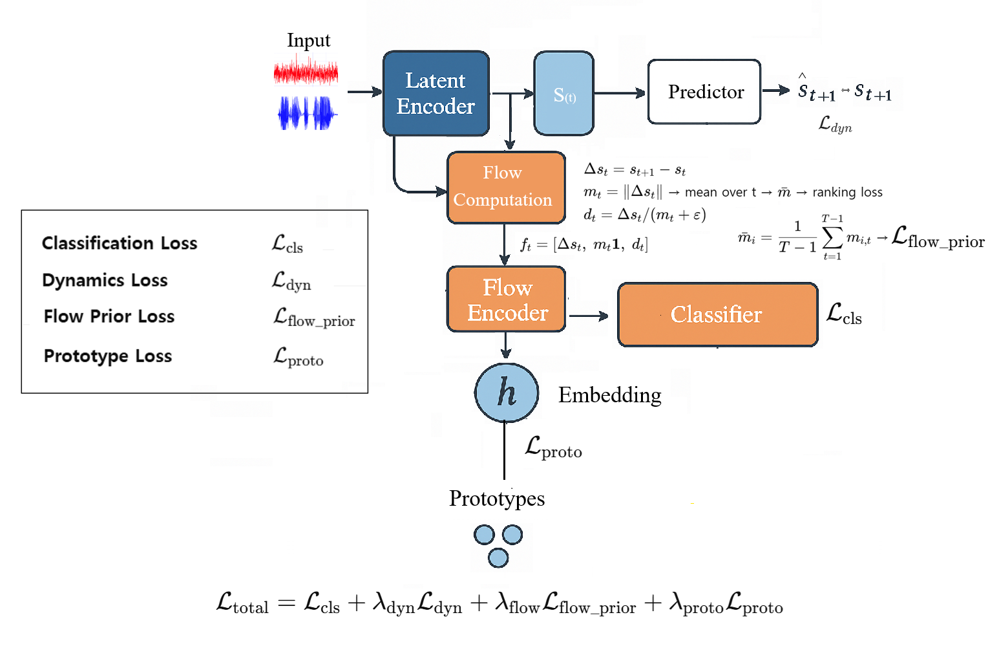

# Dynamics-Aware Action State Flow for Wearable Human Activity Recognition

<p align="center"></p>

This repository implements the methodology proposed in the paper "Dynamics-Aware Action State Flow for Wearable Human Activity Recognition".


## Paper Overview
**Abstract**: Deploying deep learning models for Human Activity Recognition (HAR) on wearable IoT devices requires a careful balance between recognition performance, strict computational and energy budgets, and robustness to sensor degradation during long-term use, especially under slowly varying, low-frequency drift. To address these challenges, we propose Action State Flow (ASF), a dynamics-aware framework that shifts from classifying static feature snapshots to learning latent transition flows (i.e., temporal state increments) organized around class-specific prototypes. The ASF framework explicitly models the temporal evolution of activities using first-order state differencing paired with flow direction normalization. This dual mechanism effectively suppresses additive low-frequency biases via differencing while mitigating multiplicative scaling artifacts through direction-magnitude disentanglement, thereby preserving intrinsic motion dynamics. To further structure the latent space, we incorporate flow-prototype regularization. Extensive experiments on five benchmark datasets (UCI-HAR, WISDM, UniMiB, PAMAP2, and MHEALTH) show that the ASF framework delivers competitive performance comparable to strong baselines, while offering a superior trade-off between accuracy and robustness against low-frequency artifacts compared to static baselines.

## Dataset
- **UCI-HAR** dataset is available at _https://archive.ics.uci.edu/dataset/240/human+activity+recognition+using+smartphones_
- **PAMAP2** dataset is available at _https://archive.ics.uci.edu/dataset/231/pamap2+physical+activity+monitoring_
- **MHEALTH** dataset is available at _https://archive.ics.uci.edu/dataset/319/mhealth+dataset_
- **WISDM** dataset is available at _https://www.cis.fordham.edu/wisdm/dataset.php_
- **UniMiB** dataset is available at _http://www.sal.disco.unimib.it/technologies/unimib-shar/

## Requirements
```
torch==2.5.0+cu126
numpy==2.0.2
pandas==2.2.2
scikit-learn==1.6.1
matplotlib==3.10.0
seaborn==0.13.2
fvcore==0.1.5.post20221221
```
To install all required packages:
```
pip install -r requirements.txt
```

## Codebase Overview
- `model.py` - Implementation of the proposed **ASF** architecture.
The implementation uses PyTorch, Numpy, pandas, scikit-learn, matplotlib, seaborn, and fvcore (for FLOPs analysis).

## Citing this Repository

If you use this code in your research, please cite:

```
@article{Learning Physically Consistent Representations for Human Activity
Recognition via Modern Temporal Convolutional Network,
  title = {Learning Physically Consistent Representations for Human Activity
Recognition via Modern Temporal Convolutional Network},
  author={JunYoung Park, Gyuyeon Lim, and Myung-Kyu Yi}
  journal={},
  volume={},
  Issue={},
  pages={},
  year={}
  publisher={}
}
```

## Contact

For questions or issues, please contact:
- JunYoung Park : park91802@gmail.com

## License

This project is licensed under the MIT License - see the [LICENSE](LICENSE) file for details.
